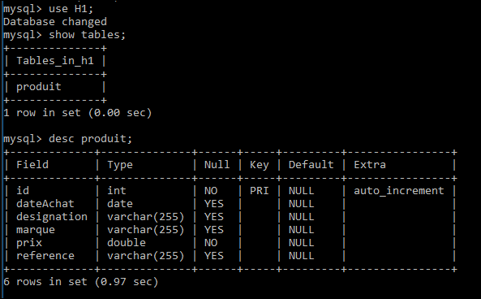
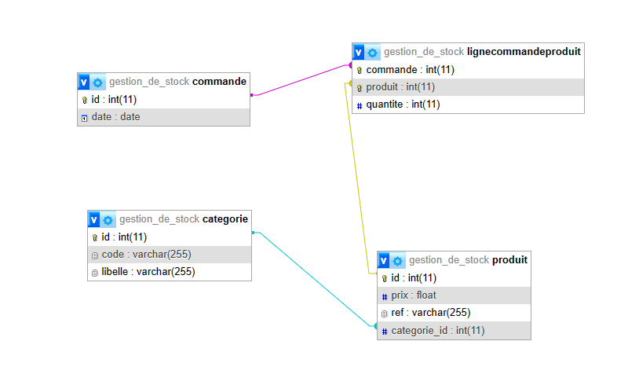
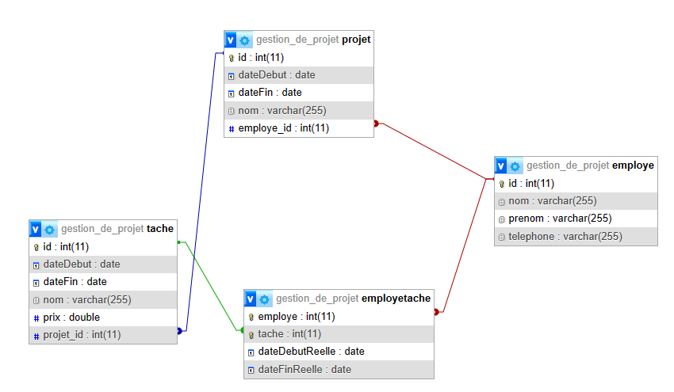
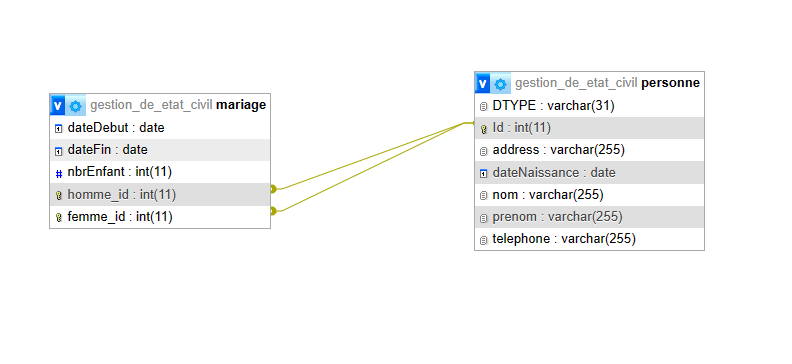

# TP Framework de persistance : Hibernate 

Solutions des Exercices TP3:

- `H1` ou `gestion_des_produits`: l'exercice 1.
- `gestion_de_stock`: l'exercice 2.
- `gestion_de_projet`: l'exercice 3.
- `gestion_d_etat_civil`: le travail a rendre 

## Diagramme de Classes:

###  Ex 1: Gestion des produits

###  Ex 2: Gestion de stock

###  Ex 3: Gestion de projet

###  TAR: Gestion d'etat civil

"# TP-Hibernate" 
